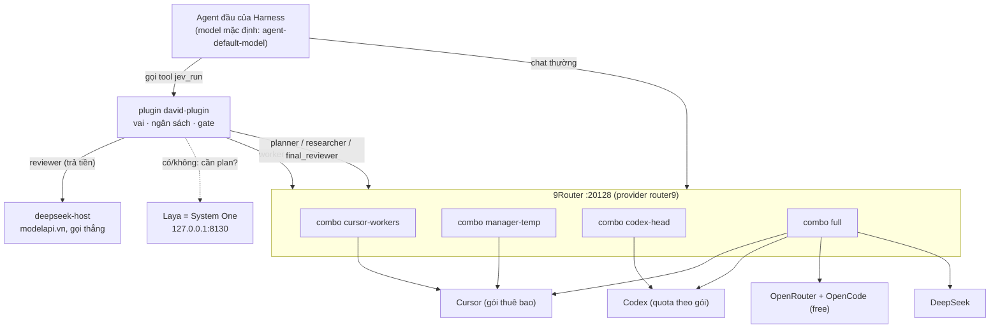

# Đĩa plugin cho DeepSeek Harness

Mẫu để viết plugin mới. Mở file này trước, làm theo khung ở §4, đi hết checklist ở §8. Mọi thứ trong §2 đã kiểm trên máy này (Harness `0.2.0-rc.2`, ngày 2026-10-06), có lệnh để kiểm lại. Mọi thứ trong §9 là chỗ chưa kiểm: đừng coi là đúng.

Muốn dựng cả hệ thống từ đầu (provider, khoá, model, combo, Laya): đọc **§11** trước, rồi quay lại §4.

Plugin mẫu hoàn chỉnh nằm cạnh file này: `plugin/david-plugin/` (một tool, gọi subagent, có ngân sách, có gate).

---

## 1. Plugin là gì ở đây

Harness chạy trên **Cordis**: mọi thứ là plugin, plugin được nạp bằng `import()` từ một entry trong cấu hình. Một plugin là một module ESM export ba thứ:

| Export | Việc |
|---|---|
| `name` | tên plugin (chuỗi) |
| `inject` | mảng tên service cần có trước khi `apply` chạy, ví dụ `["tools", "subagents"]` |
| `apply(ctx, config)` | chạy khi nạp; đăng ký tool/listener qua `ctx`. `config` là đúng cái ghi trong `config:` của entry |

Có thể export thêm `Config` (schema schemastery) để Harness kiểm cấu hình. Plugin mẫu **không** export, và không import gói `@deepseek-ai/*` nào, nên nạp được từ đường dẫn thường mà không cần pnpm.

## 2. Sự thật đã kiểm

| Điều | Bằng chứng | Kiểm lại |
|---|---|---|
| Entry thêm mới dùng `- insert: [ ... ]` trong `cordis.patch.yml`; `config` bị **thay hẳn**, không trộn | schema của patch | §8 lệnh 3 |
| `name` bắt đầu bằng `.` được neo theo **thư mục chứa file patch**, rồi đổi thành URL `file://` | `--dump-config` in ra URL đó | §8 lệnh 3 |
| Loader nạp `name` không bắt đầu bằng `.` bằng `import()` thường | mã `cordis-plugin-loader` | đọc `lib/index.js` trong app |
| Profile `desktop` do app Electron quản lý: CLI từ chối `--profile desktop`. Dùng profile `web` + `DSH_HOME` tạm để thử | thông báo lỗi của `dsh` | §8 lệnh 3 |
| `ctx.tools.register(tool)` nhận object thuần có `name`, `description`, `parameters` (JSON Schema), `output.{schema,render}`, `execute(args, exec)`, tuỳ chọn `timeoutMs` | mã `defineTool` trả về đúng dạng đó | §8 lệnh 2 |
| `exec.agent` là agent đang gọi tool, `exec.signal` là tín hiệu huỷ | mã `dsh-tool-subagent` | đọc nguồn |
| Chạy agent con: `await ctx.subagents.start(provider, {label, prompt:[{type:"text",text}], parent, agentOptions:{provider,model}, maxDepth?, signal})` → `{result, dispose()}`; `await result` cho `{stopReason, output:[{type:"text",text}], diagnostic?}` | mã `dsh-tool-subagent` | đọc nguồn |
| Provider subagent mặc định tên `spawn` (`subagent-spawn-in-process`) có sẵn trong bundle `dsh-base` | `--dump-config` profile `web` | §8 lệnh 3 |
| `steer()`/`followup()` của `Agent` nhận `{content:[{type:"text",text}], source:{kind:"plugin", plugin:"…"}}`, **không** nhận chuỗi | README `dsh-agent` | đọc README |
| Agent con chạy qua `spawn` **theo đúng route** plugin yêu cầu (`agentOptions`), và **tôn trọng `toolFilter.deny`** | chạy thật trong Harness với model giả: yêu cầu của worker tới `cursor-workers`, reviewer tới `deepseek-v4.1-flash`/`codex-head`; tool bị chặn không còn trong danh sách của con | `dev/e2e/run.sh` (§12) |
| Mặc định agent con được cấp **cả** `jev_run`, `subagent`, `subagent_fork`, `workflow` (tức có thể đẻ thêm agent trên model không ai tính ngân sách) | cùng phép chạy, trước khi thêm bộ lọc | §12 |
| Agent con **không** bắt đầu trong thư mục `cwd` mà tool nhận, mà trong thư mục làm việc của agent đầu (`pwd` của worker in ra thư mục của agent đầu) | cùng phép chạy | §12; vì vậy prompt bắt worker `cd <cwd> &&` |
| `dsh headless --patch x.yml "<việc>"` với `DSH_HOME` tạm chạy trọn một lượt agent; Harness đưa `jev_run` vào danh sách tool của model | `dev/e2e/run.sh` | §12 |
| Ở profile **desktop**, bộ lọc tool của child chỉ được nêu tên tool "toàn cục". `subagent`, `subagent_fork`, `workflow` nằm ở lớp riêng của child nên `tools.restrict()` ném `names unknown global tool "subagent"; known global tools: …` và child **không khởi động** | sổ chạy thật (`jev-runs.jsonl`): cả hai route chết sau 2–3 ms | kịch bản F (§12) |
| Phản hồi rỗng từ Cursor bị Harness coi là `EMPTY_RESPONSE` và thử lại 9 lần; 9Router thấy HTTP 200 nên combo `fallback` không chuyển model | 8 chuỗi 9 request cùng cỡ prompt, độ trễ ~220 ms (§11.9) | `dev/…` không có; đọc `requestDetails` |
| Route model của máy này: provider `router9` (9Router) với model `codex-head`, `cursor-workers`, `manager-temp`, `full`; provider `deepseek-host` với `deepseek-v4.1-flash` | `~/.dsh/profiles/desktop/cordis.patch.yml` | đọc file |
| Laya = server local `127.0.0.1:8130`, `POST /v1/systemone` với `{state, questions:{id:{type:"noul",instructions}}}` → `answers[id].noul` là xác suất "có" | gọi thật 14 lần (§11.5) | `laya-ctl status` |

## 3. Bố cục thư mục

```
<tên-plugin>/
  index.js            keo dán vào Harness: name, inject, apply, dựng tool. Mỏng.
  lib/                lõi thuần: không import Harness, mọi thứ bên ngoài được truyền vào
    config.js         DEFAULTS + resolveConfig(user)
    ...
  prompts/*.md        prompt theo vai
  package.json        {"type":"module","main":"index.js"}  (không dependencies)
<gói-zip>/
  plugin/<tên-plugin>/
  patch/<tên>.patch.yml   khối chèn, có dòng đánh dấu begin/end
  install.sh  uninstall.sh
  INSTALL.md          hướng dẫn cho agent trong Harness tự cài
  CHANGELOG.md        lịch sử version (Keep a Changelog)
  PLUGIN-TEMPLATE.md  file này
  dev/test/*.test.mjs  dev/verify-against-harness.mjs  dev/build.sh  dev/e2e/
```

## 4. Khung tối thiểu

Đoạn dưới được test tự động: `dev/test/template.test.mjs` trích đúng khối này, nạp lên và kiểm. Sửa khung thì sửa ở đây.

<!-- skeleton:index.js -->
```js
// index.js: một tool, không phụ thuộc gì.
export const name = "my-plugin";
export const inject = ["tools"];

export function apply(ctx, config) {
  const cfg = { greeting: "hello", ...(config ?? {}) };
  ctx.tools.register({
    name: "my_tool",
    description: "Say hello to someone. Use when asked to greet.",
    parameters: {
      type: "object",
      properties: { who: { type: "string", description: "Who to greet." } },
      required: ["who"],
    },
    output: {
      schema: { type: "string" },
      render: (_args, value) => [{ type: "text", text: value }],
    },
    async execute(args, exec) {
      exec.signal?.throwIfAborted();
      return `${cfg.greeting}, ${args.who}`;
    },
  });
}
```

Entry tương ứng để chèn vào `cordis.patch.yml`:

```yaml
# my-plugin:begin
- insert:
    - id: my-plugin
      name: ./plugins/my-plugin/index.js
      config: {}
# my-plugin:end
```

Plugin nằm ở `<profile>/plugins/my-plugin/`; `<profile>` là thư mục chứa `cordis.patch.yml`.

## 5. Tool gọi agent con

Chép từ `plugin/david-plugin/index.js` (`spawnChild`). Điểm cần giữ: cần provider subagent (nghe `subagent/provider-added`, gắn tool khi provider xuất hiện), luôn `dispose()` run, coi `stopReason !== "completed"` là lỗi kèm `diagnostic`, và truyền `exec.signal`.

## 6. Quy tắc rút ra khi làm `david-plugin`

1. **Tách lõi thuần khỏi keo Harness.** `lib/` nhận mọi thứ ngoài (spawn, đọc diff, chạy test, hỏi Laya) qua `deps`. Nhờ đó test được bằng agent giả, không cần boot Harness.
2. **Không phụ thuộc lúc chạy.** Viết tool dưới dạng JSON Schema đã biên dịch, không import `defineTool`. Rồi kiểm bằng `defineTool` thật (§8 lệnh 2) để không lệch.
3. **Vai quyết định model, model không tự chọn.** Tool không có tham số `model`/`provider`; mỗi vai có một chuỗi route (rẻ trước). Hết ngân sách thì **treo chờ người**, không nhảy sang route nằm ngoài chuỗi.
4. **Quyết định tốn tiền do code tính.** Trigger review là luật cứng (kích thước diff, đường dẫn rủi ro, ngoài phạm vi, test đỏ liền). Bộ phân loại (Laya) chỉ được **thêm** lý do, không được bớt.
5. **Fail closed.** Verdict không đọc được = "cần sửa". Laya sập = quay về luật, ghi chú rõ.
6. **Reviewer chỉ thấy kế hoạch + diff**, không thấy lời của worker.
7. **Đếm tiền trước khi gọi, trừ sau khi gọi, kể cả khi con chết** (input đã tiêu).
8. **Cài đặt idempotent và gỡ được:** khối đánh dấu begin/end, sao lưu trước khi sửa, gỡ xong file về đúng từng byte.
9. **Test bằng cách phá thật:** sau khi xanh, tắt từng quy tắc quan trọng và xem test có đỏ không. Một test không thể đỏ thì không bảo vệ gì.

## 7. Cấu hình có chủ đích

Mọi số liệu và tên route nằm ở `lib/config.js` (`DEFAULTS`) và ghi đè được qua `config:` trong entry patch. Nhớ: `config` thay cả khối cấp 1 khi Harness hợp patch, nhưng `resolveConfig` của plugin mẫu trộn sâu lên DEFAULTS, nên chỉ cần ghi phần muốn đổi.

## 8. Checklist trước khi giao

Chạy từ thư mục gói:

```bash
# 1. test lõi + keo (không cần Harness)
node --test dev/test/*.test.mjs

# 2. khai báo tool khớp defineTool thật của Harness
ELECTRON_RUN_AS_NODE=1 "/Applications/DeepSeek Harness.app/Contents/MacOS/DeepSeek Harness" dev/verify-against-harness.mjs

# 3. Harness chấp nhận entry patch (thư mục tạm, không đụng profile thật)
T=$(mktemp -d); mkdir -p $T/p/plugins $T/home
cp -R plugin/<tên-plugin> $T/p/plugins/ && cp patch/<tên>.patch.yml $T/p/extra.yml
DSH_HOME=$T/home "/Applications/DeepSeek Harness.app/Contents/Resources/runtime/cli/bin/dsh" \
  --profile web --patch $T/p/extra.yml --dump-config | grep -A3 "id: <tên-plugin>"
```

- [ ] test xanh, đã phá thử các quy tắc chính và thấy đỏ
- [ ] lệnh 2 báo `ok`
- [ ] `dev/e2e/run.sh` báo `PASS` cho cả hai kịch bản (cần app Harness; không cần khoá)
- [ ] lệnh 3 in ra entry với URL `file://` cạnh file patch, stderr không có `error`
- [ ] `install.sh` chạy hai lần không nhân đôi khối; `uninstall.sh` trả file patch về đúng từng byte
- [ ] version đã tăng đúng luật (§13), `CHANGELOG.md` có mục cho version đó, zip build bằng `dev/build.sh` (tên có version)
- [ ] zip không chứa khoá API, token, đường dẫn riêng của máy khác
- [ ] sau khi cài và khởi động lại Harness, tool xuất hiện trong danh sách tool của agent (đây là bước duy nhất chưa tự động hoá được)

## 9. Chưa biết, đừng tin

- Model free (OpenCode, OpenRouter) gọi tool có đủ tốt để làm worker khi Cursor hết quota không: chưa kiểm trên model thật (§11.8).
- Log nạp plugin: Harness không in dòng xác nhận. Cách xác nhận tool đã nạp là §12 (model giả ghi lại danh sách tool được đưa cho nó), hoặc hỏi agent liệt kê tool.
- Tool đăng ký bằng `ctx.tools.register` có tự gỡ khi plugin dừng hay không: các plugin chính thức không gọi disposer khi dừng, nên *có vẻ* tự gỡ; chưa kiểm.
- Provider `spawn` có thật sự **ép** `maxDepth` hay không: chưa thử (plugin không dựa vào nó nữa: con không được cấp tool đẻ agent, xem `childTools` trong `lib/config.js`). `agentOptions` và `toolFilter` thì đã kiểm (§2).
- Laya zero-shot **không** phân biệt được diff rủi ro với diff tầm thường (§11.5), và đọc tác vụ tiếng Việt sai hướng. Vì thế plugin mặc định chỉ dùng Laya cho câu hỏi "cần plan không" với tác vụ tiếng Anh. Mẫu đo nhỏ (13 ca); chưa phải hiệu chuẩn.
- Combo 9router xoay vòng hay ưu tiên theo thứ tự: đọc từ `settings` và suy từ số đếm (§11.3); chưa thử bằng một chuỗi request có đánh dấu.
- Desktop có tự nạp lại khi `cordis.patch.yml` đổi không (có plugin `hmr`): cứ khởi động lại cho chắc.

## 10. Đọc gì trong app khi cần

Các gói nằm trong `app.asar`; đọc bằng runtime đi kèm:

```bash
ELECTRON_RUN_AS_NODE=1 "/Applications/DeepSeek Harness.app/Contents/MacOS/DeepSeek Harness" -e '
const fs=require("fs"); const D="/Applications/DeepSeek Harness.app/Contents/Resources/app.asar/dsh/node_modules/@deepseek-ai";
console.log(fs.readFileSync(D+"/dsh-agent-default-model/lib/index.js","utf8"))'
```

| Gói | Đọc để học |
|---|---|
| `dsh-agent-default-model` | plugin nhỏ nhất: service + Config |
| `dsh-tool-subagent` | đăng ký tool, gọi `ctx.subagents.start`, xử lý `stopReason` |
| `dsh-agent` (README) | API `Agent`: `create/resume/steer/followup/inject/cancel/whenIdle` |
| `dsh-experimental-agent-team` | đội agent có tên, bảng việc chung, bền qua crash |
| `cordis-plugin-loader` (README) | các trường của entry: `id`, `name`, `config`, `group`, `disabled`, `inject` |

Danh sách đầy đủ các trường patch: `DSH_HOME=$(mktemp -d) dsh --profile web --dump-config-schema`.

---

## 11. Thiết lập hệ thống: một hệ thống, từ trên xuống

Phần này mô tả cách máy này đang chạy và cách nên đặt. **Đo** = lấy từ máy ngày 2026-10-06. **Nên** = khuyến nghị của tôi, có lý do kèm theo. Không có khoá nào được ghi ở đây, chỉ tên biến.

### 11.1 Sơ đồ



Hai đường **không** đi qua 9Router: `deepseek-host` (tiền) và Laya (local). Vì vậy bộ đếm chi tiêu của plugin là chốt chặn duy nhất cho DeepSeek.

### 11.2 Provider và khoá

Phía Harness, entry `llm-pi-ai` trong `cordis.patch.yml` (bản đang chạy, đã bỏ phần thừa; file chỉ chứa **tên** biến, không chứa khoá):

```yaml
- id: llm-pi-ai
  name: "@deepseek-ai/dsh-llm-pi-ai"
  config:
    providers:
      router9:
        displayName: 9Router
        apiKeyEnv: ROUTER9_API_KEY
        api: openai-completions
        baseURL: http://localhost:20128/v1
        models: [{id: codex-head}, {id: manager-temp}, {id: cursor-workers}, {id: full}]
      deepseek-host:
        apiKeyEnv: DEEPSEEK_HOST_API_KEY
        api: openai-completions
        baseURL: https://modelapi.vn/v1
        models: [{id: deepseek-v4.1-flash, name: deepseek-v4.1-flash}]
```

| Tầng | Provider | Cần gì | Khoá nằm ở đâu | Đo trên máy |
|---|---|---|---|---|
| Harness | `router9` | khoá của 9Router | biến môi trường `ROUTER9_API_KEY` của app | dùng |
| Harness | `deepseek-host` | khoá modelapi.vn | biến `DEEPSEEK_HOST_API_KEY` | khai báo; chưa thấy lượt gọi trong 9Router vì gọi thẳng |
| 9Router | `codex` | đăng nhập tài khoản Codex | trong 9Router, không phải file | 548 lượt / 24 giờ |
| 9Router | `cursor` | đăng nhập tài khoản Cursor | trong 9Router | 2001 lượt / 24 giờ |
| 9Router | `openrouter` | khoá OpenRouter, chỉ dùng model `:free` | trong 9Router | 53 lượt |
| 9Router | `opencode` (`oc/*`, free) | không có hàng riêng trong danh sách connection | | 464 lượt |
| 9Router | `DeepSeek` (openai-compatible) | khoá modelapi.vn | trong 9Router | **1 lượt**: gần như thừa vì Harness gọi `deepseek-host` thẳng |
| 9Router | `v1m` `laya-local` | địa chỉ Laya | trong 9Router | 17 lượt (`rev-latest`); plugin không dùng đường này |

Kiểm biến có đặt chưa mà không in giá trị (chỉ kiểm shell hiện tại, không phải môi trường của app; thiếu thì lần gọi đầu báo 401):

```bash
for v in ROUTER9_API_KEY DEEPSEEK_HOST_API_KEY; do [ -n "${!v:-}" ] && echo "$v: set" || echo "$v: MISSING in this shell"; done
```

**Nên:** giữ khoá ngoài `cordis.patch.yml` và ngoài zip; mỗi khoá một biến; không dùng chung khoá 9Router cho client khác nếu muốn đếm riêng.

### 11.3 Combo và thứ tự ưu tiên

> Phần này mô tả trạng thái **đo được lúc đầu** (2026-10-06). Trạng thái đã chỉnh, tên `main` (trước là `full`) và công tắc `Combo Round Robin` nằm ở **§11.9**.

Đo từ bảng `combos` và `settings` của 9Router (`~/.9router/db/data.sqlite`, mở chỉ-đọc):

| Combo | Model (theo thứ tự lưu) | Chiến lược |
|---|---|---|
| `codex-head` | 10 model `cx/*`; **đầu danh sách là `cx/gpt-6-luna`**, rồi `gpt-6.1-sol`, `gpt-6-astra`, … | xoay vòng (theo mặc định toàn cục) |
| `cursor-workers` | `cu/default` | xoay vòng |
| `manager-temp` | `cu/default` | **fallback** (theo thứ tự) |
| `full` | 15 model: `cu/default`, `cx/gpt-6.1-sol`, `cu/claude-4.6-opus-max`, `deepseek/deepseek-v4.1-flash`, `cu/kimi-k2.5`, 5 model OpenRouter free, 5 model OpenCode free | xoay vòng; sửa lần cuối 2026-10-06 17:39 |

Điều cần hiểu:

1. **Dưới xoay vòng, thứ tự trong combo không phải ưu tiên.** Số đếm khớp điều đó: bốn model Cursor khác nhau cùng đúng 141 lượt. Bằng chứng trực tiếp hơn: trong một cửa sổ 2 phút (2026-10-06 01:10–01:12 UTC) 9Router nhận đúng năm model, mỗi model 5 lượt (4 với model cuối): `cx/gpt-6.1-sol`, `cu/claude-4.6-opus-max`, `cu/default`, `cu/kimi-k2.5`, `oc/muse-spark-1.3-contributor-free`; cả năm đều là thành viên của combo `full`, và `gpt-6.1-sol`, `opus-max` được gọi nhiều ngang `cu/default` miễn phí. (`usageHistory` không có cột combo, nên đây vẫn là đối chiếu theo thời gian, không phải gán thẳng request vào combo.)
2. **`codex-head` không ghim vào model mạnh nhất**: nó xoay qua cả `luna`, `sol`, `astra`, `terra`… Vai planner/final_reviewer muốn model mạnh và đoán trước được.
3. **`full` trộn lẫn model trả tiền, quota và miễn phí.** Nếu `agent-default-model` là `router9/full` (đúng như `cordis.patch.yml` đang đặt), thì cứ khoảng 1 trong 15 lượt chat của agent đầu rơi vào DeepSeek (tiền), 1 trong 15 vào `gpt-6.1-sol` (quota), 1 trong 15 vào `claude-4.6-opus-max`.
4. 24 giờ qua theo **giá niêm yết 9Router tự tính** (không phải hoá đơn; Cursor và Codex là gói): Cursor 2001 lượt ≈ $225, trong đó `claude-4.6-opus-max` 352 lượt ≈ $66; Codex 548 lượt ≈ $31. Lịch sử này chưa phản ánh cấu hình `full` mới sửa.

**Nên đặt:**

| Combo | Chiến lược | Thứ tự | Lý do |
|---|---|---|---|
| `codex-head` | **fallback** | model bạn muốn dùng nhiều nhất lên **đầu** (hiện là `luna`: nếu đổi sang fallback mà không xếp lại thì `luna` thành model chính), model yếu hơn/rẻ quota xuống sau | planner, researcher, final_reviewer cần nhất quán; fallback chỉ tốn model sau khi model đầu lỗi hoặc hết hạn mức |
| `cursor-workers` | xoay vòng | `cu/default` (nếu có nhiều tài khoản Cursor thì xoay tài khoản) | worker chạy nhiều, miễn phí theo gói |
| `manager-temp` | fallback | `cu/default`, rồi vài model OpenRouter/OpenCode `:free` | là đường lui miễn phí của planner/researcher khi hết quota Codex; không bao giờ rơi xuống Codex hay DeepSeek |
| `full` | giữ làm "tất cả", **không dùng làm mặc định** | bỏ `deepseek/deepseek-v4.1-flash` và các model trả tiền ra khỏi xoay vòng | để DeepSeek chỉ đi qua plugin, nơi có trần chi tiêu |

**Nên đổi `agent-default-model`** từ `router9/full` sang `router9/manager-temp` (miễn phí). Đánh đổi: agent đầu yếu hơn một chút, vì nó chỉ chia việc và gọi `jev_run`; phần tốn model mạnh đã nằm trong plugin. Nếu thấy agent đầu chia việc dở, đổi sang `codex-head` (fallback) và chấp nhận hao quota.

Đổi chiến lược combo trong dashboard 9Router (cổng 20128). Tên mục tôi chưa kiểm trực tiếp; đừng sửa file SQLite khi 9Router đang chạy.

### 11.4 Ghép vai → chuỗi route → combo → nguồn

Đây là nơi **ưu tiên thật sự** được quyết (plugin `lib/config.js`, `chains`), cao hơn thứ tự trong combo. Quy tắc của chủ máy (2026-10-06): **OpenCode và OpenRouter là backup chạy cuối cùng**, chỉ khi các nguồn trước hết quota hoặc lỗi. Nên `backup` luôn là mục **cuối** của mọi chuỗi (có test giữ quy tắc này).

| Vai | Chuỗi route (rẻ trước, backup cuối) | Combo / provider | Nguồn | Loại phí |
|---|---|---|---|---|
| worker | `cursor` → `backup` | `router9/cursor-workers` → `router9/backup-free` | Cursor → OpenCode/OpenRouter | gói → miễn phí |
| planner | `codex` → `manager` → `backup` | `router9/codex-head` → `router9/manager-temp` → `router9/backup-free` | Codex → Cursor → free | quota → gói → miễn phí |
| researcher | `codex` → `manager` → `backup` | như trên | | |
| reviewer | `deepseek` → `codex` → `backup` | `deepseek-host/deepseek-v4.1-flash` → `router9/codex-head` → `router9/backup-free` | DeepSeek → Codex → free | tiền → quota → miễn phí |
| final_reviewer | `codex` → `backup` | `router9/codex-head` → `router9/backup-free` | Codex → free | quota → miễn phí |

Một route được coi là "hết" theo hai cách: **ngân sách** trong sổ của plugin (Codex theo lượt, DeepSeek theo token), hoặc **lỗi lúc chạy** (hết quota Cursor, DeepSeek hết tiền, HTTP lỗi). Route vừa lỗi bị bỏ qua 10 phút (`limits.routeCooldownMs`) để các lượt sau đi thẳng sang route kế tiếp.

### 11.5 System One (Laya)

**Là gì:** bộ phân loại chạy local, một lượt cho ra xác suất của câu hỏi có kiểu (`choice`, `score`, `noul` = có/không). Không sinh văn bản, không thay được model chat. Bản đang chạy là **Python `laya` 0.3.28** (`laya-serve`), do `laya-ctl` bọc; repo `receptron/laya` là bản Node/ONNX, không phải cái đang chạy.

| Việc | Cách |
|---|---|
| Cài lại | `uv pip install 'laya[serve]'` vào `~/.local/share/laya/venv` (695 MB) |
| Bật/tắt/xem | `~/.local/bin/laya-ctl start \| stop \| restart \| status \| logs` |
| Cổng, bộ nhớ | `127.0.0.1:8130`, thiết bị `mps`, tự giải phóng checkpoint sau 600 s rảnh (`LAYA_IDLE_UNLOAD_SECONDS`) |
| Giữ luôn sống | `./install.sh --keepalive` (LaunchAgent chạy `laya-ctl status \|\| laya-ctl start` mỗi phút); plugin cũng tự `laya-ctl start` khi gọi lỗi, tối đa 5 phút một lần |
| Gọi | `POST /v1/systemone` `{"state":"…","questions":{"id":{"type":"noul","instructions":"…"}}}` → `answers.id.noul` (xác suất "có") |
| Độ trễ đo | lần đầu sau khi tự giải phóng 3.4–6.3 s, các lần sau 0.04–0.2 s |

**Đã đo (14 lần, 2026-10-06, chưa tinh chỉnh):**

| Câu hỏi | Ca | p(có) |
|---|---|---|
| needs_plan | đơn giản tiếng Anh ×3 | 0.16, 0.08, 0.09 |
| needs_plan | phức tạp tiếng Anh ×3 | 0.76, 0.71, **0.10** (ca "double-charge": trượt) |
| needs_plan | tiếng Việt: đơn giản / phức tạp | 0.00 / **0.06** (phức tạp mà ra "không") |
| needs_review | tầm thường ×2 | 0.25, 0.18 |
| needs_review | rủi ro thật ×3 (đổi băm mật khẩu, xoá cột, tắt kiểm quyền admin) | **0.33, 0.19, 0.20** |

Kết luận đã áp vào plugin: `needs_plan` dùng được cho tác vụ **tiếng Anh**, và chỉ để *thêm* một lượt plan; tác vụ tiếng Việt bỏ qua Laya, quyết theo độ dài. `needs_review` **tắt mặc định** (`laya.reviewEnabled: false`): zero-shot nó không tách được diff rủi ro khỏi diff vụn. Luật cứng (đường dẫn rủi ro, cỡ diff, ngoài phạm vi, test đỏ liền) mới là thứ gọi reviewer trả tiền.

**Muốn Laya đáng tin hơn:** tinh chỉnh bằng diff thật của bạn (`laya-train --data <csv> --out <thư mục>`, và `laya-evals` để đo). README của Laya nêu checkpoint đã tinh chỉnh đạt 0.766 so với 0.362 của bản gốc trên benchmark của *họ*; con số của bạn có thể khác. Chỉ bật `reviewEnabled` khi `laya-evals` trên tập của bạn đạt mức bạn chấp nhận, rồi mới chỉnh `reviewThreshold`. Chưa thử `LAYA_AUTO_TASK=1` (tự chuyển sang checkpoint typed-decisions).

### 11.6 Thứ tự thiết lập từ đầu

1. **9Router** chạy ở cổng 20128. Thêm connection: Codex (đăng nhập), Cursor (đăng nhập), OpenRouter (khoá, chỉ model `:free`), OpenCode (free).
2. **Combo** theo bảng §11.3: đặt chiến lược từng combo, xếp thứ tự, bỏ model trả tiền khỏi `full`.
3. **Biến môi trường** cho app Harness: `ROUTER9_API_KEY`, `DEEPSEEK_HOST_API_KEY`. Kiểm bằng lệnh ở §11.2.
4. **Harness** (`cordis.patch.yml`): entry `llm-pi-ai` đúng như §11.2, id model **trùng tên combo**; entry `agent-default-model` theo §11.3.
5. **Laya**: `laya-ctl start`, `laya-ctl status` thấy `UP`.
6. **Plugin**: `./install.sh --keepalive`, khởi động lại Harness, xác nhận có tool `jev_run`.
7. **Chạy một việc nhỏ** bằng `jev_run` trong repo thử; báo cáo phải `done`, chỉ một agent Cursor chạy, không review.
8. **Sau 24 giờ**, đo lại và chỉnh `budgets` (số hiện tại là giả định):

```bash
sqlite3 -readonly -header -column ~/.9router/db/data.sqlite \
 "select provider, model, count(*) n, sum(promptTokens) prompt_tok, round(sum(cost),2) notional_cost
  from usageHistory group by provider, model order by n desc limit 25;"
cat ~/.dsh/jev-ledger.json    # chi tiêu hôm nay theo route, do plugin ghi
```

### 11.7 Xem plugin đã chạy những ai

Có ba nơi, từ nhanh đến chi tiết:

| Nơi | Cho biết | Giới hạn |
|---|---|---|
| **Báo cáo của `jev_run`**, mục `Who ran:` | từng vai, route (`provider/model`), khoá route, giây, token ước lượng; Laya trả bao nhiêu; dòng `not called:` liệt kê vai **không** chạy | `model` là tên **combo** (`codex-head`…), không phải model thật phía sau |
| **Sổ chạy** `~/.dsh/jev-runs.jsonl` (một dòng mỗi lần `jev_run`, kể cả lần lỗi) | như trên, kèm thời điểm bắt đầu/kết thúc, `cwd`, `status`, lỗi | cũng chỉ thấy combo |
| **`node ~/.dsh/profiles/desktop/plugins/david-plugin/who.mjs [N]`** | N lần chạy gần nhất, cộng với những gì **9Router thực nhận** trong khoảng thời gian đó, theo `provider/model` thật | gộp cả traffic khác trong cùng cửa sổ (ví dụ agent đầu đang chat); `deepseek-host` gọi thẳng nên **không** hiện ở 9Router, chỉ hiện ở báo cáo và sổ chạy |

Cách đọc:

- Vai chạy trên combo nào: báo cáo. Combo đó thực sự chọn model nào: `who.mjs` (hàng `cursor/default`, `codex/gpt-6.1-sol`…). Nếu `codex-head` còn xoay vòng (§11.3), bạn sẽ thấy nhiều model `cx/*` khác nhau trong một lượt.
- Ví dụ một lượt đúng: `laya needs_plan: p=…`, một dòng `worker-1 -> router9/cursor-workers`, và `not called: planner, researcher, reviewer, final_reviewer`. Nếu thấy `reviewer` hoặc `final_reviewer` mà không có dòng `Review triggers:` thì có lỗi.
- Chi phí DeepSeek: chỉ báo cáo, sổ chạy và `~/.dsh/jev-ledger.json` (token ước lượng) đếm được; 9Router không thấy.

## 12. Chạy thử đầu-cuối trong Harness thật, không cần khoá

Test đơn vị chỉ chứng minh lõi đúng; điều dễ sai nằm ở chỗ plugin gặp Harness (agent con bắt đầu ở đâu, được cấp tool gì, route có đúng không). `dev/e2e/run.sh` kiểm đúng chỗ đó:

```bash
dev/e2e/run.sh        # cần app DeepSeek Harness, node, git; không đụng ~/.dsh, không dùng khoá hay quota
```

Cách hoạt động: dựng profile tạm (`DSH_HOME` tạm) với entry `llm-pi-ai` trỏ mọi provider về một server model **giả** chạy local (`dev/e2e/fake-llm.mjs`, giao thức OpenAI streaming), chèn plugin bằng `--patch`, rồi gọi `dsh headless "<việc>"`. Server giả trả lời theo kịch bản (`dev/e2e/script.mjs`): đóng vai agent đầu (gọi `jev_run`), worker (chạy `bash` sửa file), reviewer (duyệt). Mỗi request đều được ghi lại với tên model và danh sách tool được cấp, nên có thể khẳng định:

| Kịch bản | Khẳng định (`dev/e2e/check.mjs`) |
|---|---|
| A: sửa nhỏ | báo cáo `done`; chỉ worker trên `router9/cursor-workers` chạy; không model trả tiền nào bị gọi; worker không được cấp `jev_run`/`subagent`/`subagent_fork`/`workflow`; sổ chi tiêu không được ghi |
| B: sửa dưới `src/auth` | thêm reviewer trên `deepseek-host/deepseek-v4.1-flash` và final reviewer trên `router9/codex-head`; dòng `Review triggers: risky path`; reviewer không được cấp tool ghi file hay tool đẻ agent; sổ chi tiêu có DeepSeek và đúng 1 lượt Codex |

Đã thử phá: bỏ `toolFilter`, đổi route worker, tắt đường dẫn rủi ro: cả ba đều làm `run.sh` báo lỗi.

Dùng cho plugin khác: chép `dev/e2e/`, sửa `script.mjs` (kịch bản) và `check.mjs` (khẳng định). Hai điều cần nhớ: server giả phân vai theo **tên model** mà plugin định tuyến tới, và `DSH_HOME` phải là thư mục tạm để không chạm profile thật. Giới hạn: model giả không kiểm được chất lượng câu trả lời, chỉ kiểm đường đi, quyền và chi phí. **Profile headless không chứng minh được hành vi của profile desktop** (bài học 0.5.2: bộ lọc tool qua e2e mà vẫn chết ở desktop); kịch bản F cố ý ép Harness ném đúng lỗi từ chối của desktop. CLI không chạy được profile `desktop`, nên điều cuối cùng phải kiểm bằng một lần chạy thật trong app.

## 13. Đặt version

**Một nguồn duy nhất:** `plugin/<tên>/package.json`, trường `version`, theo SemVer `MAJOR.MINOR.PATCH`. Mọi chỗ khác đọc từ đó, không gõ tay lại:

| Chỗ | Cách lấy |
|---|---|
| `export const version` của plugin | đọc `package.json` lúc nạp |
| cuối báo cáo `jev_run`: `Plugin: david-plugin <version>` | từ `version` |
| mỗi dòng sổ chạy `jev-runs.jsonl` (`"version"`) và `who.mjs` (`(plugin <version>)`) | từ `version` |
| `install.sh`: `version: 0.2.0 -> 0.3.0` / `new install` / `same version reinstalled` | so `package.json` bản đang cài với bản mới |
| tên zip `david-plugin-<version>.zip` | `dev/build.sh` |
| `CHANGELOG.md` | mục `## [<version>] - YYYY-MM-DD` |

**Luật tăng version** (khi `MAJOR` còn là 0, tăng `MINOR` được phép đổi mặc định hoặc khoá cấu hình, nên đọc changelog trước khi nâng cấp):

- **MAJOR**: bỏ hoặc đổi tên một tham số của tool, hoặc một khoá `config:`; hoặc đổi mặc định khiến khối `config:` cũ mang nghĩa khác.
- **MINOR**: thêm hành vi, tham số tuỳ chọn, khoá cấu hình mới; đổi một giá trị mặc định.
- **PATCH**: sửa lỗi, sửa tài liệu.

**Quy trình ra bản mới:** sửa `version` trong `package.json` → thêm mục vào `CHANGELOG.md` (giữ `## [Unreleased]` ở trên cùng) → `dev/build.sh --e2e`.

`dev/build.sh` **từ chối build** khi version không phải SemVer, khi `CHANGELOG.md` không có mục cho version đó, hoặc khi test hỏng; nó cũng không đóng thư mục `dist/` của các lần build trước vào zip. Test (`dev/test/version.test.mjs`) giữ các chỗ trên khớp nhau: tăng `package.json` mà quên changelog thì test đỏ.

**Lưu ý:** bản đang chạy trong Harness là bản đã nạp vào bộ nhớ; chép bản mới vào profile chưa đổi gì cho tới khi khởi động lại. Muốn biết Harness đang chạy bản nào: xem dòng `Plugin:` ở cuối báo cáo `jev_run` gần nhất, hoặc `node who.mjs` (cột `(plugin x.y.z)`); bản trên đĩa thì xem `package.json` trong thư mục plugin.

### 11.8 Tầng backup miễn phí (OpenCode, OpenRouter)

Hai lớp cùng làm một việc, nên cần cả hai:

| Lớp | Lo việc gì | Ai chỉnh |
|---|---|---|
| **Combo 9Router** | khi Cursor/Codex hết quota *thật*, 9Router tự đi tiếp trong combo (chiến lược `fallback`); áp dụng cả cho agent đầu của Harness | bạn, trong dashboard 9Router (API của 9Router đòi đăng nhập, mình không vượt qua) |
| **Chuỗi route của plugin** | ngân sách trong sổ (Codex, DeepSeek) và lỗi lúc chạy, kể cả DeepSeek vì nó gọi thẳng, không qua 9Router | `lib/config.js` / `config:` trong patch |

**Combo cần tạo hoặc sửa trong 9Router** (thứ tự xếp theo độ tin cậy đã đo ở §11.3, mẫu 24 giờ nên nhỏ):

| Combo | Chiến lược | Thành viên theo thứ tự |
|---|---|---|
| `backup-free` (**mới**) | `fallback` | `oc/muse-spark-1.3-contributor-free` (lỗi 1%, chậm nhất 17 s) → `oc/fledge-alpha-free` (0%, chỉ 8 mẫu) → `openrouter/nvidia/nemotron-3-ultra-550b-a55b:free` (17%, 24 s) → `oc/muse-spark-1.2-contributor-free` (11%) → `oc/longcat-2.5-preview-free` (3% nhưng chậm nhất 130 s: để cuối) |
| `manager-temp` | `fallback` (đang đúng) | giữ `cu/default` đứng đầu, **nối thêm** danh sách `backup-free` ở trên phía sau; để agent đầu cũng rơi xuống free khi Cursor hết |
| `codex-head` | đổi sang `fallback` | xếp model mạnh nhất lên đầu (§11.3); không cần thêm free, plugin đã có chuỗi `codex` → `manager` → `backup` |
| `cursor-workers` | giữ | chỉ `cu/default`. **Đừng** thêm model free vào đây nếu chiến lược còn là xoay vòng: nó sẽ chia việc cho model free ngay cả khi Cursor còn quota |
| `full` | | bỏ các model hay lỗi: `laguna-s-2.1:free` (84%), `apodex-1.1-mini:free` (64%, kèm trả về toàn khoảng trắng), `ling-3.1-flash-free` (57%), `nemotron-3-super:free` (40%), `north-mini-code:free` (28%). Chúng **không** vào `backup-free` |

**Phía Harness:** thêm `- id: backup-free` vào danh sách `models` của `router9` trong entry `llm-pi-ai` của `cordis.patch.yml` (cạnh `codex-head`, `manager-temp`, `cursor-workers`, `full`). Thiếu dòng này plugin gọi model chưa khai báo và route backup lỗi.

**Phải biết khi dùng backup:**

- Plugin báo rõ: dòng `[backup, fallback]` trong `Who ran:` và ghi chú `<vai> ran on the BACKUP route: expect lower quality`.
- **Review chỉ bởi backup không đủ để đóng một diff rủi ro.** Mặc định (`backupPolicy.reviewIsFinal: false`) diff đó kết thúc `awaiting_human` kèm ghi chú; reviewer backup từ chối thì luôn dừng chờ người. Bật `reviewIsFinal: true` nếu bạn chấp nhận review miễn phí là đủ.
- **Chưa kiểm:** model free có gọi tool tốt không (worker cần `bash`, `edit`). Mình đã kiểm đường đi, quyền và chi phí bằng model giả (§12), chưa kiểm chất lượng trên model free thật. Thử trước bằng cách chọn `router9/backup-free` làm model cho một cuộc chat nhỏ cần sửa file.
- `backup-free` chưa tồn tại trong 9Router thì route backup lỗi, và vai bị treo chờ người như bản 0.3.0.

### 11.9 Trạng thái đã chỉnh (2026-10-07) và những gì phải biết

**Combo 9Router hiện tại** (đều chạy `fallback`: thử theo thứ tự, lỗi mới sang model kế tiếp):

| Combo | Thành viên theo thứ tự | Dùng cho |
|---|---|---|
| `manager-temp` | `cu/default` → 5 model free | model mặc định của agent đầu Harness |
| `main` (tên cũ `full`) | `cu/default` → `cu/kimi-k2.5` → `cx/gpt-6.1-sol` → `deepseek/deepseek-v4.1-flash` → 5 model free | combo "đủ bộ", chọn tay khi cần; rẻ và nhanh trước, tính tiền sau, free cuối |
| `codex-head` | `cx/gpt-6.1-sol` đầu, 9 model Codex còn lại giữ thứ tự | planner, researcher, reviewer cuối của plugin |
| `cursor-workers` | chỉ `cu/default` | worker của plugin |
| `backup-free` | `muse-spark-1.3` → `fledge-alpha` → `nemotron-3-ultra-550b:free` → `muse-spark-1.2` → `longcat-2.5` | route `backup` của plugin, cuối mọi chuỗi |

5 model free này xếp theo độ tin cậy đo được. Chúng **chỉ là backup**: đứng cuối mọi combo, và hết quota rất nhanh.

**Chiến lược combo không đọc từ giao diện combo.** Mã của 9Router chọn: mục riêng của combo → công tắc toàn cục **Settings → Routing Strategy → Combo Round Robin** → `fallback`. Công tắc toàn cục từng *bật*, nên mọi combo không có mục riêng đều xoay vòng dù trang combo ghi "Fallback". Giao diện combo không lưu được "fallback" tường minh: chọn Fallback chỉ xoá mục riêng. Vì vậy cách đúng để có fallback cho tất cả combo là **tắt công tắc toàn cục** (đã tắt). Kiểm: `comboStrategy` trong bảng `settings` của `~/.9router/db/data.sqlite` phải là `fallback`.

**Đổi tên combo** (`full` → `main`): sửa ở dashboard 9Router (giữ nguyên `id` nội bộ) **và** một dòng `- id: main` trong danh sách model của `router9` ở `cordis.patch.yml`. Trước khi đổi, tìm mọi chỗ gọi tên cũ (patch, plugin, model mặc định, khoá API, công cụ bên ngoài).

**Giới hạn tải Cursor (plugin 0.5.0).** Cursor từng rate-limit vì số worker song song không có trần. Hiện: tối đa **3** child cùng lúc trên Cursor (`cursor-workers` và `manager-temp` dùng chung trần), cách nhau tối thiểu **2 s** giữa hai lần khởi động, áp dụng cho **mọi** lần gọi `jev_run` cùng lúc; child dư thì xếp hàng, không bị từ chối. Một lần gọi có quá 6 sub-task hoặc quá 3 câu hỏi research bị từ chối trước khi chạy. Chỉnh trong `config:` của entry: `limits.concurrency`, `limits.startGapMs`, `limits.maxTasks`, `limits.maxResearch`. Báo cáo ghi `(queued 4.2s)` cho child phải chờ.

**Cách đọc trang Usage của 9Router** (`/dashboard/usage`) và nguyên nhân thật của "Retry delay" (đo 2026-10-07, thay cho phần ghi sai trước đó):

- **Cursor trả phản hồi rỗng tức thì mà vẫn báo thành công.** 317 trong 602 request Cursor (prompt trên 5k token) được trả lời dưới 400 ms, có giờ chiếm trên 80% (20 giờ UTC: 174/210). Harness coi mỗi phản hồi đó là lỗi `EMPTY_RESPONSE` và **thử lại tới 9 lần** (1 lần gọi + 8 lần thử, lùi giãn cách 1 s, 1,3 s, 2,4 s … 31 s, tổng khoảng 70 s). Trên trang Usage đó là một chuỗi `default` cùng cỡ token vào, mỗi lần khoảng 220 ms. Có 8 chuỗi đúng 9 request như vậy trong mẫu. Mỗi lần thử lại là một request Cursor nữa, nên một lần gọi bị **nhân 9**: đó là kiểu "spam Cursor".
- **9Router không thấy lỗi nào**, vì Cursor trả HTTP 200. Combo `fallback` chỉ chuyển model khi có lỗi, nên các model free phía sau **không bao giờ được dùng** cho trường hợp này; mỗi lần thử lại lại vào đúng `cu/default`.
- **Lời giải thích cũ là sai:** phần "các model free hay lỗi gây Retry delay" (apodex trả khoảng trắng…) không phải nguyên nhân chính. Số đo các model free ở §11.3 vẫn đúng, nhưng chúng không gây ra chuỗi thử lại này.
- **Dòng `[Empty streaming response]`** trong sổ 9Router không chứng minh gì: đó là giá trị mặc định của bộ ghi log khi không thu được nội dung (xảy ra với mọi luồng, kể cả luồng tốt). Dấu hiệu đáng tin là **nhịp thử lại** và **độ trễ ~220 ms**.
- **Chưa biết** vì sao Cursor trả rỗng (nghi hết quota/giới hạn tốc độ phía Cursor, chưa chứng minh). Xem mức dùng ngay trên tài khoản Cursor.
- **Núm chỉnh trong Harness:** entry `llm-pi-ai`, từng provider có `retryPolicy` (`mode: normal`, `maxRetries` mặc định 5, `retryableCodes` mặc định `EMPTY_RESPONSE`, `RATE_LIMIT`, `SERVER`, `TIMEOUT`, `TRANSPORT`, `backoff`). Hạ `maxRetries` của `router9` cắt phần nhân lên và làm một child của plugin thất bại nhanh để rơi sang backup (`maxRetries: 2` ngày 2026-10-07).
- **Hệ quả cho plugin:** một child trên Cursor có thể mất ~70 s trước khi thất bại; sau đó route bị đặt cooldown 10 phút nên các lần gọi sau đi thẳng sang backup.

### 11.10 Cursor: không có API, và combo không tự rơi khi nguồn trả rỗng (đo 2026-10-07)

**Đã đo.** Nguồn Cursor của người dùng là dịch vụ chạy cùng app Cursor (app 助手 đổi token trên đường đi). Từ ngoài app, cùng một yêu cầu chat gửi thẳng, qua proxy của app, đổi phiên bản client hay đổi endpoint đều nhận `ERROR_NOT_LOGGED_IN` nằm **trong luồng HTTP 200**. 9Router không đọc lỗi đó, ghi `[Empty streaming response]`, và coi model là "thành công". Hậu quả:

| Combo | Trước | Hậu quả |
|---|---|---|
| `cursor-workers` | `cu/default` | luôn rỗng |
| `manager-temp` | `cu/default` rồi 5 model free | **không bao giờ xuống 5 model free**: `cu/default` "thành công" rỗng |
| `main` / `full` | `cu/default`, `cu/kimi-k2.5` đứng đầu | cùng lỗi: agent đầu nhận trả lời rỗng |

**Đã làm ở plugin.** Một route trả về không có chữ nào bị tính là hỏng (xem `lib/pipeline.js`): lượt gọi rơi xuống route kế và route đó nghỉ `routeCooldownMs`. Có test và đã phá thử code để chắc test đỏ.

**Việc phải làm ở 9Router (người dùng làm trong dashboard).** Đưa mọi model `cu/*` xuống **cuối** các combo `manager-temp` và `main`. Chừng nào chúng còn đứng đầu, agent đầu của Harness vẫn nhận trả lời rỗng.

**Dùng hạn mức Cursor đã mua: hàng đợi tệp.** Đặt `chains: { worker: [cursorqueue, backup] }`. Plugin ghi task vào `~/.dsh/cursor-queue/pending/`; người dùng nói với app Cursor: *"Xử lý hàng đợi Jev trong `~/.dsh/cursor-queue`: đọc README.md và làm theo."* App chuyển task sang `claimed/`, sửa file trong `cwd`, ghi `done/<id>.md`; plugin chạy test và review như thường. Task không ai nhận trong `cursorQueue.waitMs` (5 phút) bị rút lại (`expired/`) và route backup làm việc đó, nên không bao giờ chờ người vô hạn và không làm hai lần. Giao thức đầy đủ nằm trong `README.md` của thư mục hàng đợi (plugin tự ghi).
